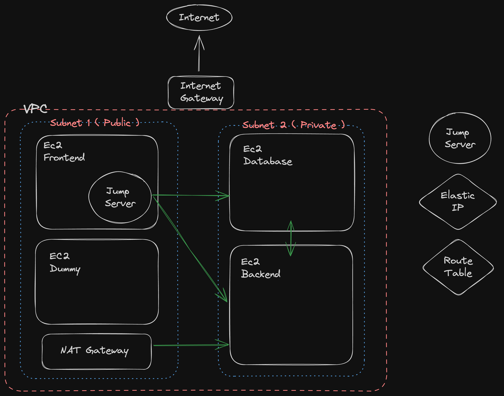

# Mini-network
  ---
  - The Business Problem
    ---
    A small company FridayHITT provide customised different HITT training every Friday with running routes local to your location. They have approached you to design a mini network for the online presence. They can see that the company will expand rapidly so they want the design to be extensible from the start. They know that applying good practices from the start will make this easier. Provide appropriate services and documentation to get them going.

# Learning Outcomes:
  ---
  This assignment focuses on bringing IaC concepts together in a business solution via a mini-network.

# Sample basic plan
  ---
  Designed a basic plan to solve business problem. 
  

  ---
  